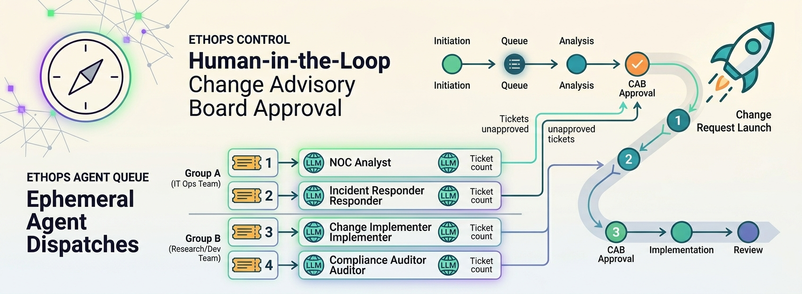
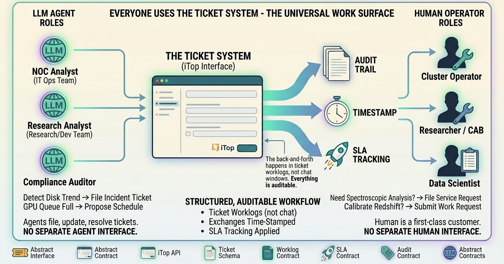
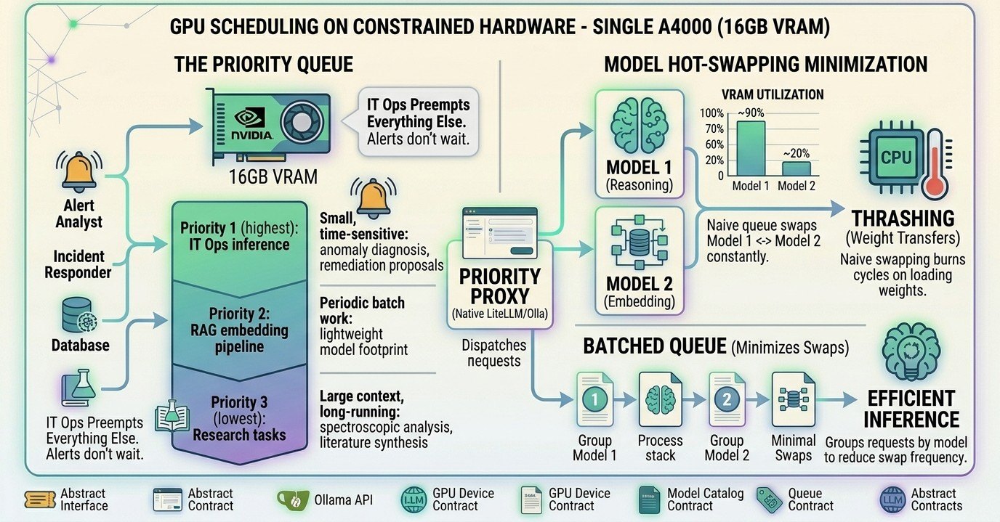
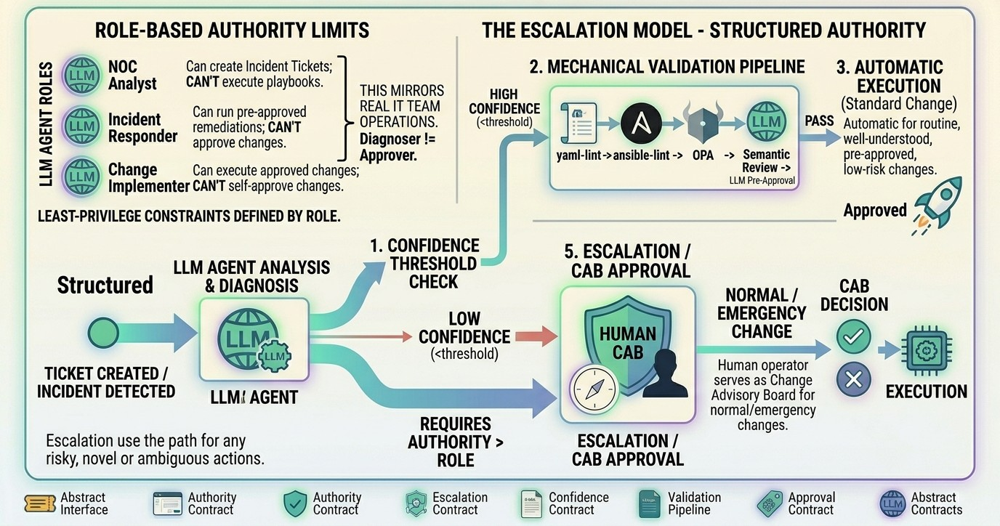
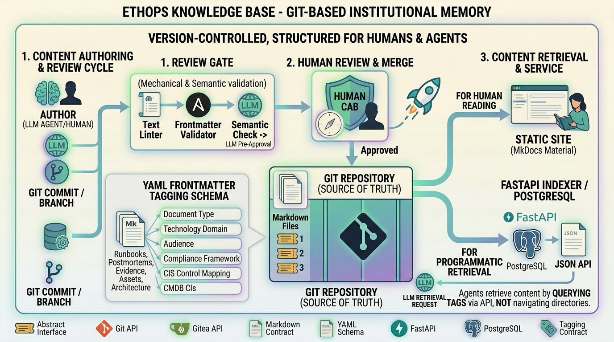

<!--
---
title: "Ethops"
description: "ITIL-driven autonomous DevOps team framework for scientific computing infrastructure"
author: "VintageDon"
date: "2026-03-21"
version: "0.2"
status: "Pre-Implementation"
tags:
  - type: project-root
  - domain: [autonomous-ops, itil, scientific-computing]
  - tech: [python, itop, postgresql, ollama, proxmox]
related_documents:
  - "[Proxmox Astronomy Lab](https://github.com/vintagedon/proxmox-astronomy-lab)"
  - "[Astronomy RAG Corpus](https://github.com/vintagedon/astronomy-rag-corpus)"
---
-->

# Ethops



[](https://python.org)
[](https://www.itophub.io/)
[](LICENSE)

> Ephemeral LLM agents coordinated through tickets, not conversations.

Ethops (ephemeral ops) implements an autonomous DevOps team whose members happen to be LLM agents, organized through standard ITIL processes on the [Proxmox Astronomy Lab](https://github.com/radioastronomyio/proxmox-astronomy-lab) research cluster. Two teams, IT Ops and Research/Dev, share an iTop ITSM instance as their work surface, handling both autonomous cluster operations and service requests from the Astronomy Team. A persistent orchestrator dispatches work; the Astronomy Team serves as Change Advisory Board.

---

## Overview

Most multi-agent AI systems coordinate agents through conversation graphs, routing prompts between specialized nodes. This is effective for text generation workflows but doesn't produce the artifacts infrastructure operations require: audit trails, SLA metrics, change records, compliance evidence.

Ethops organizes agents the way a professional IT team is organized. The vocabulary is standard ITIL: incidents, problems, changes, service requests. Each agent maps to a real IT role (NOC Analyst, Incident Responder, Change Implementer, Compliance Auditor) with a job description, least-privilege access, and a tamper-evident action log. Agents spin up for a task, work a ticket, and terminate. No persistent daemons. No agent-to-agent communication. Everything flows through the ticket system.

The result is an autonomous operations system that produces the same artifacts a human team would: ticket histories with SLA tracking, change records with mechanical and semantic validation, daily health reports, compliance evidence, and structured documentation submitted as pull requests for human review, with every action recorded in a tamper-evident log. All of it running on a single GPU and open-source tooling.

---

## How the Team Works

### Everyone Uses the Ticket System

The ticket system is the universal work surface. Agents use it. The human operator uses it. There is no separate "agent interface" and "human interface." When the NOC Analyst detects a disk trending toward capacity, it files an incident ticket. When the researcher needs a DESI spectroscopic analysis run, they file a service request. Both enter the same queue, get the same SLA tracking, produce the same audit trail.



This is the part most multi-agent frameworks miss. They position the human as an overseer monitoring autonomous processes. In ethops, the human is a first-class customer of the agent team. Need research done on a new dataset? File a ticket. The Research Analyst agent picks it up, proposes a research plan, and works through it with you before executing. The deliverable comes back as a ticket update with a structured report.

Need GPU time for a training run? File a ticket. The orchestrator checks the queue, and if your job conflicts with scheduled ops work, the agent comes back with a proposed schedule: "Priority 1 ops window runs 02:00-04:00 UTC, your job can start at 04:15, or I can move it to the weekend maintenance window."

Need an ML pipeline adjusted because the redshift calibration is drifting? You guessed it: file a ticket. An agent pulls the script from Github, diagnoses the issue, proposes a fix, and submits a PR for your review, complete with code review.

The human operator isn't just approving agent-initiated changes. They're submitting work, receiving proposals, negotiating priorities, and reviewing deliverables through the same structured workflow the agents use among themselves. The back-and-forth happens in ticket worklogs, not chat windows. Every exchange is auditable, timestamped, and tied to a service level agreement.

### The Autonomous Operations Rhythm

The other side of the ticket system runs without human input. The IT Ops team operates on a rhythm familiar to any NOC. Several times per day, the NOC Analyst agent wakes, pulls 24 hours of telemetry deltas, log summaries, metric trends, and ticket history across the entire cluster. A single batched LLM assessment covers all nodes. If something looks wrong, it files an incident ticket. If everything is clean, it writes a health report to the knowledge base. Then it terminates.

When Alertmanager fires between daily reviews, the SDM orchestrator catches the webhook and dispatches a fresh triage instance. If remediation is needed, the Incident Responder picks up the ticket, works it through diagnosis, and either executes a pre-approved playbook or escalates to the human operator for approval. Each agent in the chain reads the ticket, does its job, writes its findings, and dies. The ticket is the coordination surface. Agents never talk to each other.

### GPU Scheduling on Constrained Hardware

The entire system shares a single NVIDIA A4000 (16GB VRAM) for all LLM inference. This is deliberate. On constrained hardware, the GPU queue is the hard problem, not the inference itself.

Three priority tiers govern access: IT Ops, our RAG embedding and any astronomy MLOps, and finally the research tier.



IT Ops preempts everything else. When an alert fires at 3 AM, the triage agent doesn't wait behind a research job. The priority proxy handles this seamlessly, and provide request prioritization natively.

The subtler problem is model hot-swapping. Loading a reasoning model consumes most of the 16GB VRAM. Unloading it to run an embedding model, then reloading it for the next reasoning request, burns GPU cycles on weight transfers instead of inference. The queue groups requests by model to minimize swap frequency: batch the embedding work together, batch the reasoning work together, avoid thrashing between them. On a single GPU, this scheduling discipline is the difference between a system that works and one that spends half its time loading weights.

### The Escalation Model

Agents don't have unlimited authority. Every persona operates under least-privilege constraints defined by its role. The NOC Analyst can create incident tickets but can't execute playbooks. The Incident Responder can run pre-approved remediations but can't approve changes. The Change Implementer can execute approved changes but can't self-approve them. This mirrors how a real IT team operates: the person who diagnoses the problem is not the person who approves the fix.



When an agent's confidence drops below threshold, or the action requires authority beyond its role, it escalates to the human operator. The operator serves as Change Advisory Board for normal and emergency changes. Standard changes (well-understood, pre-approved, low-risk) execute automatically after passing the mechanical validation pipeline. The system is designed to handle routine operations autonomously while routing anything novel, risky, or ambiguous to a human.

---

## Project Status

| Area | Status | Description |
|------|--------|-------------|
| Architecture | ✅ Validated | Multiple research iterations and design sessions |
| Documentation | ✅ Complete | Repository scaffolding, standards, templates |
| iTop Deployment | ✅ Complete | VM provisioning and initial CMDB population |
| Orchestrator | ✅ Complete | SDM skeleton on bare-metal node |
| IT Ops Agents | ✅ Complete | Daily review agent, alert-driven incident response |
| Research Agents | ⬜ In Progress | Scientific workflow execution |

---

## Architecture

Ethops operates on the [Proxmox Astronomy Cluster](https://github.com/radioastronomyio/proxmox-astronomy-lab), a 7-node Proxmox research cluster dedicated to astronomical survey data processing. A bare-metal orchestrator node (AMD 5950X, 128GB, dual A4000 16GB nVidia GPUs) hosts agent processes and local LLM inference. All stateful services are distributed across cluster VMs over a dual 10G backbone.

### Key Components

| Component | Role |
|-----------|------|
| iTop | ITSM backbone: tickets, CMDB, change management, SLA tracking, dispatch rules |
| SDM Orchestrator | Persistent service on the orchestrator node. Watches the ticket queue, manages GPU priority, ensures SLA compliance. Not an LLM, a dispatcher. |
| Ephemeral Agents | LLM agents instantiated for a single task. Work one ticket, update it, terminate. State lives in the ticket and action log, never in the agent. |
| PostgreSQL | Agent state and task queue (SKIP LOCKED), deep telemetry, pgvector for RAG semantic layer |
| Neo4j | Infrastructure topology graph: agents traverse relationships instead of inferring them, reducing hallucination surface in RCA and impact assessment where the graph is current |
| RabbitMQ | Real-time VM telemetry from observers, dead letter escalation |
| Ollama | Local inference on A4000 with priority queue proxy. IT Ops (highest) → RAG embedding (medium) → Research (lowest). |

### Interface Abstraction

Every input to the system sits behind an abstract interface contract. Seven contracts are defined: ticket system, monitoring, telemetry, CMDB, knowledge base, GRC/compliance, and inference. An eighth (infrastructure knowledge graph) adds topology traversal. The orchestrator and agents consume protocols, never vendor APIs directly.

This means the architecture is portable. The reference implementation uses iTop, Prometheus, OSQuery, and Ollama. An alternative deployment could use ServiceNow, Datadog, CrowdStrike, and Azure OpenAI: same orchestration logic, different adapters.

### Change Enablement Pipeline

Mechanical validation runs before any LLM touches a change:

```
yamllint → ansible-lint → OPA/Rego conftest → LLM semantic review → CAB approval
```

Standard changes auto-execute after passing the mechanical floor. Normal changes queue for human approval. The LLM's only job: "does this change make sense given the current cluster state?" A question it's good at, applied after deterministic tools have already caught structural errors.

### Compliance and Governance

The cluster is being hardened to [CIS Controls v8.1 Implementation Group 1](https://www.cisecurity.org/controls), 56 safeguards covering asset inventory, secure configuration, audit logging, access control, backup verification, and incident response. Ethops agents are governed as AI systems under RadioAstronomy.io's NIST AI RMF-aligned governance framework, with lifecycle checkpoints, risk classification, and model cards for each persona. The operational implementation is documented in the [NIST AI RMF Cookbook](https://github.com/vintagedon/nist-ai-rmf-cookbook).

This governance exists not because regulations require it, but because autonomous agents making infrastructure decisions that affect research data integrity carry a duty of care. RadioAstronomy.io voluntarily adopted Colorado SB-24-205's Duty of Care framework as the regulatory anchor for this responsibility.

### Knowledge Base

The ethops-kb is a version-controlled knowledge base structured for both human reading and programmatic agent retrieval. All agent-authored content passes through the same review gates as code. The human operator reviews and merges.



Documents are classified through a structured tagging schema: document type, technology domain, audience (agent/human/both), compliance framework, specific CIS control mapping, and references to CMDB configuration items. Agents retrieve content by querying tags, not by navigating directories. This is the institutional memory of the agent team: runbooks, asset sheets, incident postmortems, compliance evidence, architecture documentation, all version-controlled, all structured for both human reading and programmatic retrieval.

### Action Accountability

Every agent action is recorded in a tamper-evident log before execution. The log is designed so that retroactive modification or deletion of records is detectable.

The log captures identity (which persona, which ephemeral instance), timing, action type (query, ticket update, playbook execution, PR submission, inference request), context (ticket reference, affected CIs, KB documents), outcome, and inference cost (model, tokens, latency).

This serves three functions: operational visibility (what are the agents doing right now), debugging (what exactly happened when something went wrong), and compliance evidence (auditable action records with tamper detection supporting processing integrity requirements across multiple frameworks).

---

## Repository Structure

```
ethops/
├── assets/                       # Images, banners, infographics
├── docs/                         # Public documentation
│   ├── documentation-standards/  # Template library and guidelines
│   └── data-science-infrastructure.md
├── AGENTS.md                     # Agent conventions and constraints
├── CODE_OF_CONDUCT.md
├── CONTRIBUTING.md
├── LICENSE                       # MIT (code)
├── LICENSE-DATA                  # CC-BY-4.0 (data/content)
├── SECURITY.md
└── README.md
```

---

## Design Decisions

### Why iTop

iTop's community edition includes full ITIL processes, a customizable CMDB with CI types for servers and VMs, REST API for programmatic ticket lifecycle, webhooks, automated dispatch rules with state machines, SLA calculation, and data synchronization collectors for Azure/AWS/Ansible. All free, self-hosted. The architecture depends on ITIL processes and a ticket system with these capabilities, not on iTop specifically. iTop was selected on economics and completeness.

### Why Ephemeral Agents

Persistent daemon agents accumulate state, consume resources continuously, and create failure modes that compound over time. Ephemeral agents spin up with clean context, do one job, update one ticket, and terminate. The orchestrator is the only persistent process, and it's a dispatcher, not an LLM. On constrained hardware (single GPU, shared between ops and research inference), this is the only model that doesn't create resource contention problems.

### Why ITIL as the Coordination Model

ITIL gives you incident/problem/change/request classification, SLA tracking, change control with approval workflows, and standard metrics (MTTD, MTTR, change success rate) as inherent properties of running work through tickets. These are not features to build. They're byproducts of the organizational model.

### Why a Knowledge Graph for Infrastructure

Flat CMDBs answer "what exists?" but not "what connects to what, across what layers?" When an agent needs to assess blast radius or trace root cause, a flat record requires it to infer dependencies, and that inference step is where hallucination risk increases. A layered graph (physical → network → virtualization → storage → service → application → external) lets agents traverse structural facts instead. The graph is the eighth interface contract.

---

## Scientific Workload Context

The cluster exists for astronomical survey data processing. Ethops serves this mission, not the other way around.

| Pipeline | Domain |
|----------|--------|
| Fink Broker | ZTF/LSST transient alert streams (~10M alerts/night expected) |
| DESI Analysis | Spectroscopic data: void galaxies, QSO anomaly detection, quasar outflows |
| SDSS Cross-matching | Multi-survey catalog correlation |
| astronomy-rag-corpus | Federated knowledge core with semantic (pgvector) and topological (Neo4j) retrieval |

Three active DESI research projects drive the cluster's computational workload. The IT Ops team keeps the infrastructure running so the Research/Dev team can focus on producing analysis-ready datasets.

---

## License

- Code: [MIT License](LICENSE)
- Data/Content: [CC-BY-4.0](LICENSE-DATA)

---

## Acknowledgments

- [iTop by Combodo](https://www.itophub.io/) — Open-source ITSM that makes the architecture possible
- [Steven Vik](https://dev.to/svik) — Autonomous AI agents on Proxmox, prior art
- [Nathan Broadbent](https://github.com/ndbroadbent) — Self-healing infrastructure with OpenClaw